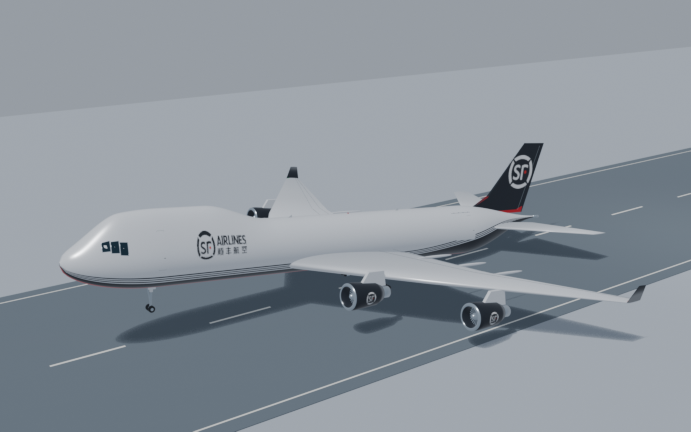
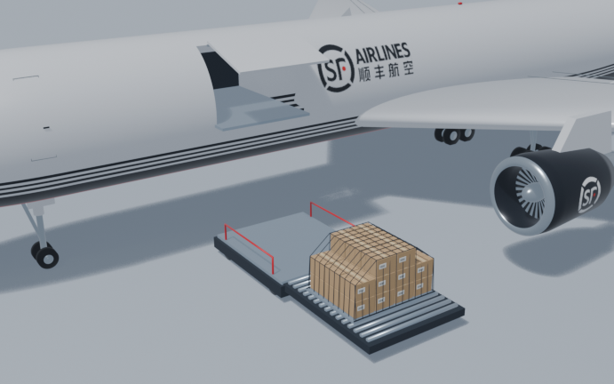
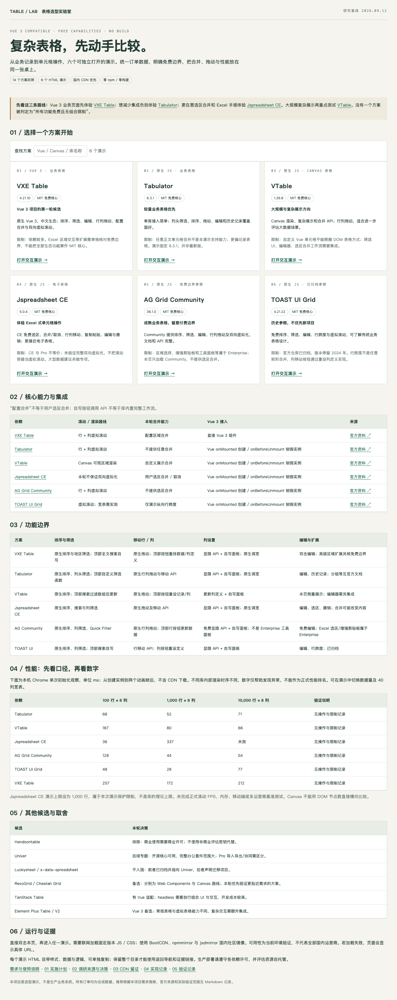
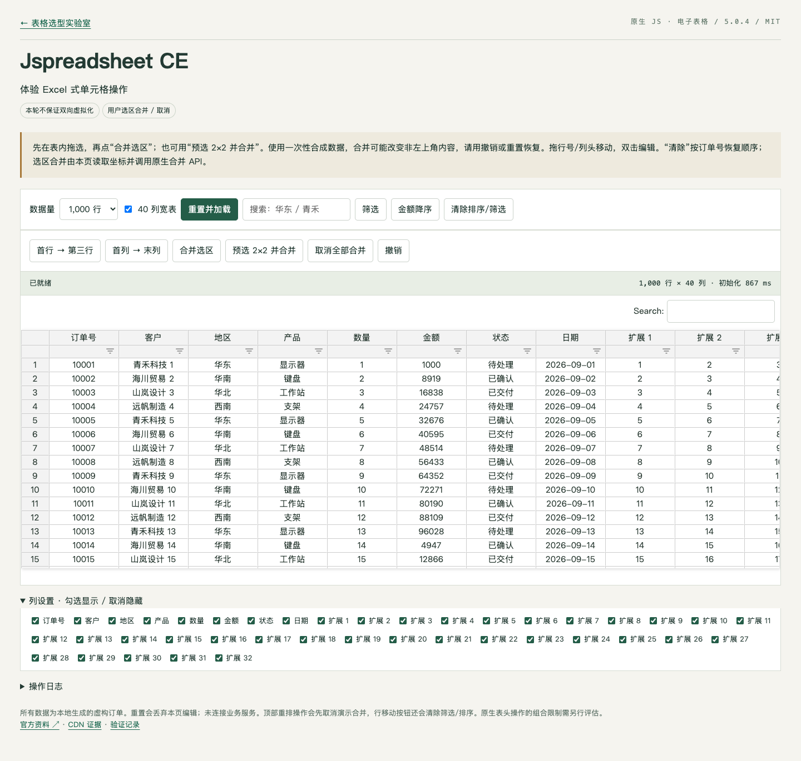
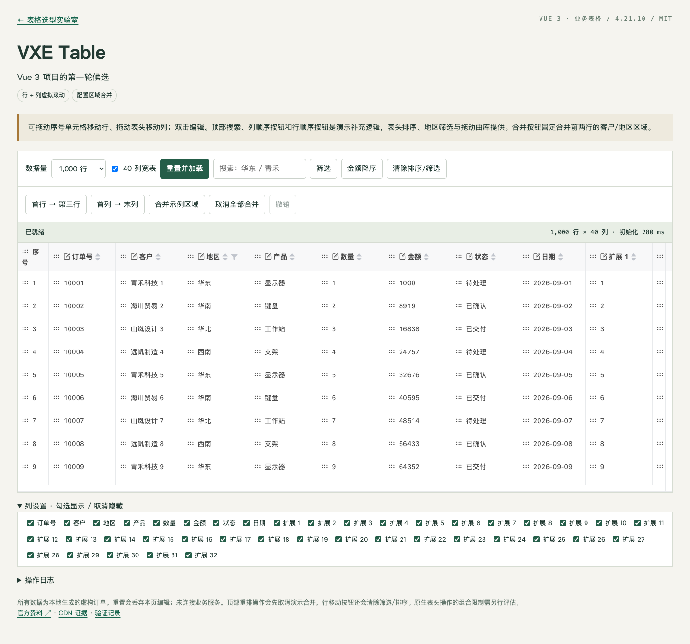

# 新增本地案例：飞机建模与复杂表格选型

> 归档于 2026-09-16。主要依据两个项目的 `IMPLEMENTATION-NOTES.md` 及同目录产物。这里记录的是项目当次行为，不把项目复盘中的外部资料描述升级为当前事实；对外发布前应重新核对官网、许可证、版本及品牌素材使用权。

## 为什么值得纳入

这两个案例都比“AI 帮我搜几篇文章”更能说明调研的工程价值，但承担不同角色：

| 案例 | 调研问题 | 从信息到行动 | 推荐位置 |
|---|---|---|---|
| 顺丰航空货机建模 | **这个对象究竟是什么、哪些形态与数字有依据？** | 官网机型与参数、波音尺寸、外观图片观察 → 参数化 Blender 脚本 → GLB/可编辑工程 → 浏览器与渲染检查 | A：来源路由、图片来源与“资料如何进入可编辑资产”；长版可独立 1–2 页，现场版更适合 WPS 后的短对照 |
| Web Excel 选型 | **哪类库满足当前免费、Vue 3、交互语义和 CDN 约束？** | 需求槽位 → 14 候选 → 官方许可/API → 固定版本 CDN → 六个同数据演示 → 真实状态断言与条件性建议 | S：候选池、双轴筛选、最小实验；很适合替换抽象方法页，现场版可独立 2–3 页 |

与原有案例的区别：WPS 讲“参考如何被翻译成协议和工具”；飞机讲“事实、视觉参考与创作性资产如何保持边界”；Web Excel 讲“不能把不同产品类别排成单一排行榜，必须先建立可比较实验”。因此不建议把两案扩成两个完整产品展示。

## 案例一：顺丰航空货机建模

### 决策问题与搜索空间

原需求并非“做几架飞机”，而是“用于顺丰航空宣传的、其实际拥有的货机及起飞和打板动画”。项目据此限定为 737-800BCF、757-200F、767-300BCF 和 747-400ERF 四款代表机型；没有把其他未经本次资料确认的机型填进去。来源分工也明确：顺丰航空官网回答机队和公开运力；波音材料回答翼展和三视尺寸；官方照片与标识帮助观察涂装；本机 Blender 与浏览器回答“做出来的资产是否可编辑、可渲染、可交互”。

可上台的“调研动作”不是机型数字列表，而是这条链：

```text
品牌与机型事实 → 机身/翼展参数 → 造型假设 → 生成脚本
                 ↘ 图片只作观察      ↘ GLB + .blend + 浏览器检查
```

重要边界：项目复盘明确说 747 详情页当时超时，未读取字段没有被补猜；官网照片只用于临时观察，没有进入交付项目；四款模型是宣传概念可视化，不是工程图或机务规程。品牌 SVG 和机型缩略图进入项目并被处理成贴图，但**公开可访问不等于自动取得公开演讲或再分发授权**。本资料库仅保存本人项目的渲染预览，不复制第三方照片或官网 SVG；对外演讲前仍要核对品牌使用范围。

### 从资料到工程对象

- 数据在原项目 [`src/data/fleet.ts`](/Users/wang/Documents/ChatGPT/aircraft-modeling/src/data/fleet.ts) 中集中维护，带原始来源 URL，避免公开参数散落硬编码。
- 参数化建模脚本 [`scripts/build_aircraft.py`](/Users/wang/Documents/ChatGPT/aircraft-modeling/scripts/build_aircraft.py) 将尺寸与机型差异翻译成几何；[`scripts/stage_blender.py`](/Users/wang/Documents/ChatGPT/aircraft-modeling/scripts/stage_blender.py) 保存可编辑动画场景。
- `Blender MCP` 两次无法连接后，改用本机 Blender CLI；这是工具通道失败后的合理降级，但不宜讲成“AI 自主建模能力比较”。
- 浏览器发现了标识拉伸、条纹台阶、货舱开口不明显和窄屏贴边等问题，回到素材与生成脚本修正，再重新导出、观察。构建和测试不能替代视觉验收。

### 可用画面与证明边界





| 画面 | 可证明 | 不可证明 |
|---|---|---|
| 747 Blender 渲染 | 当次 `.blend` 的相机、灯光、几何和贴图产生了可见画面 | 精确气动造型、真实涂装许可、动画持续性 |
| 767 打板渲染 | 货板、箱体和升降机等概念场景已被生成 | 真实装机安全流程、现场操作正确性 |

建议演说句：“AI 不是直接从一句‘做顺丰飞机’跳到三维模型。先确定有哪些真实机型、哪些数字可引用、照片能否进入交付物，再把可用信息翻译进模型参数和可编辑工程。”

## 案例二：Web Excel 选型

### 先定义“像 Excel”到底指什么

原始需求“Vue 3 里的复杂表格”被拆成免费/商业边界、排序筛选、列设置、行列移动、合并/取消、用户选区合并、性能与虚拟滚动、无需构建的 HTML 和国内方便访问的 CDN。更关键的分叉是：**业务记录表格**以行记录为单位，**电子表格**以单元格和选区为单位。VXE、Tabulator、Jspreadsheet CE、Univer 不能只按功能总数排名。

这是“先设计调研再搜索”的高质量例子。项目调查 14 个候选，但没有把 14 个方案全做成演示；先看维护、具体包许可证、免费功能边界和官方 API，再将六个方案做成同数据、同任务的独立 HTML。这里最值得演示的不是赢家名单，而是**排除和保留理由**。

### 从网页资料到可比较实验

| 信息/实验层 | 当次做法 | 收紧了什么结论 |
|---|---|---|
| 官方文档、仓库、包元数据 | 看许可、归档状态、版本和 CE/Pro、Community/Enterprise 边界 | “仓库开源”不能推出目标功能免费 |
| 固定版本 CDN HTTP 检查 | 记录地址、状态、类型、体积与耗时 | `200` 只能说明资源可取，不能说明产物适合浏览器 |
| 浏览器加载 | 六个独立 HTML 使用 `file://` 打开 | 对应资源当次确实能在本机 Chrome 加载 |
| 数据和实例状态断言 | 查询合并区域、行列顺序、筛选结果等 | “按钮没报错”不能替代实际状态变化 |
| 截图目视检查 | 看索引页、宽表和窄屏布局 | 自动断言不能发现遮挡和滚动区问题 |

尤其适合讲的两个细节：`xe-utils/min.js` 返回 HTTP 200，却是单个 CommonJS 函数，不是预期完整 UMD 包；Tabulator 的行移动按钮无报错，但 `before/after` 语义与假设不同，必须断言目标订单最终所在行。这两个细节分别说明“获取成功不等于可用”和“动作发生不等于目标成立”。另一个可视例子是 Jspreadsheet 宽表滚动条被挤，靠截图目视发现后调整；但复盘没有记录真实鼠标操作滚动条的断言，演讲不得将其说成已自动验证。







这三张图片是原项目 `.cache/` 中当次浏览器验证截图的副本；它们证明页面外观和数据被渲染，不证明排序、拖动或合并正确。功能结论必须回到 [`browser-results.json`](/Users/wang/Documents/ChatGPT/web-excel/docs/browser-results.json)、[`interaction-results.json`](/Users/wang/Documents/ChatGPT/web-excel/docs/interaction-results.json) 与脚本。缓存副本已纳入本资料库，防止原项目清理 `.cache/` 后丢失演说素材。

### 条件性结论，而不是通用排行榜

项目对 Vue 3 业务记录表格优先体验 VXE，对轻量集成考虑 Tabulator，对选区/单元格操作考虑 Jspreadsheet CE，对完整电子表格工作区另评估 Univer。这个建议只绑定本项目条件和 2026-09-12 的版本基线；没有跨网络、跨浏览器、重复性能实验，也没有穷尽复杂操作组合。不能把演示页的单次初始化毫秒数做成库性能排行榜。

建议演说句：“选型前先问要的是记录表格还是电子表格。让 AI 把 14 个候选按许可、免费能力和任务语义缩成可比较实验，再让真实浏览器告诉我们按钮背后有没有发生目标状态变化。”

## 进入既有故事板的方式

| 现有页 | 可替换/补强的点 | 是否改动 55 页母版 |
|---|---|---|
| 06–12：Brief、答案槽位、候选池、双轴筛选 | Web Excel 的需求约束、14→6 候选和 CE/Pro 边界比抽象矩阵更直观 | 暂不改；压缩现场版时优先借用 |
| 13–14：证据网络与停止搜索 | Web Excel 的“HTTP 200→包格式→浏览器→状态断言”和 Univer 专项追加问题 | 暂不改 |
| 15–23：WPS 参考到资产 | 飞机“资料→参数→可编辑模型”的跨媒介对照，可作为一张短插页 | 暂不改；防止抢走 WPS 主案例 |
| 47–49：验证媒介与措辞 | 飞机渲染/浏览器、表格实例状态/截图分别证明不同事情 | 适合作四格图中的真实视觉素材 |
| 附录/问答 | 两案完整决策链、版本、图片/品牌来源、测试边界 | 保留详细档案，不挤进主体 |

**编辑判断**：Web Excel 是更强的“AI 辅助调研后再动手”新主张样本；飞机案例的视觉吸引力更强，但必须作为“证据边界与资料转资产”的短例，避免演讲滑向飞机建模展示。具体是否进入 45 分钟正式版，留待冷读和彩排决定。

## 回查入口

- 飞机项目复盘：[`IMPLEMENTATION-NOTES.md`](/Users/wang/Documents/ChatGPT/aircraft-modeling/IMPLEMENTATION-NOTES.md)，以及 [`README.md`](/Users/wang/Documents/ChatGPT/aircraft-modeling/README.md)、[`fleet.ts`](/Users/wang/Documents/ChatGPT/aircraft-modeling/src/data/fleet.ts)、[`manifest.json`](/Users/wang/Documents/ChatGPT/aircraft-modeling/public/models/manifest.json)。
- 表格项目复盘：[`IMPLEMENTATION-NOTES.md`](/Users/wang/Documents/ChatGPT/web-excel/IMPLEMENTATION-NOTES.md)，以及 [`02-research.md`](/Users/wang/Documents/ChatGPT/web-excel/docs/02-research.md)、[`03-cdn.md`](/Users/wang/Documents/ChatGPT/web-excel/docs/03-cdn.md)、[`05-validation.md`](/Users/wang/Documents/ChatGPT/web-excel/docs/05-validation.md)、[`06-univer-assessment.md`](/Users/wang/Documents/ChatGPT/web-excel/docs/06-univer-assessment.md)。
- 演示截图副本见 [`assets/cases/`](../assets/cases/)；源项目中 `.cache/`、`artifacts/` 是当次输出，不要把它们等同正式发布证据库。
